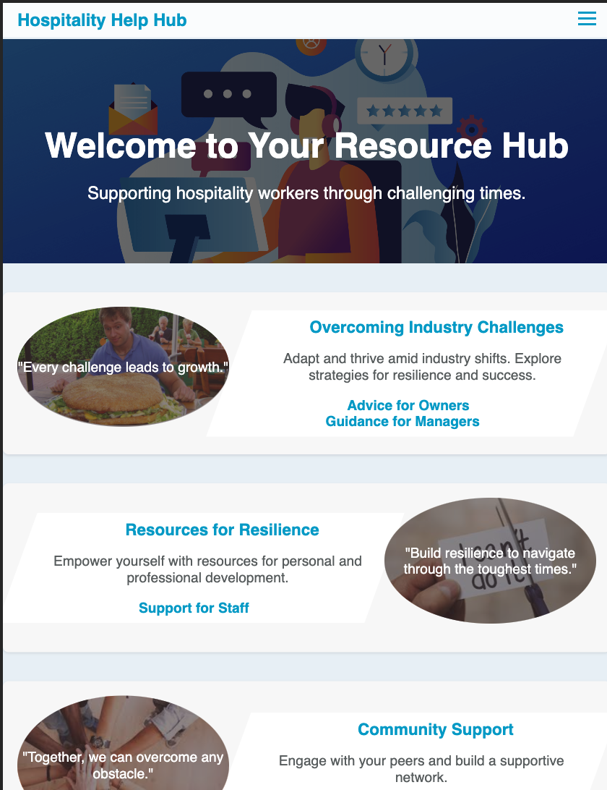
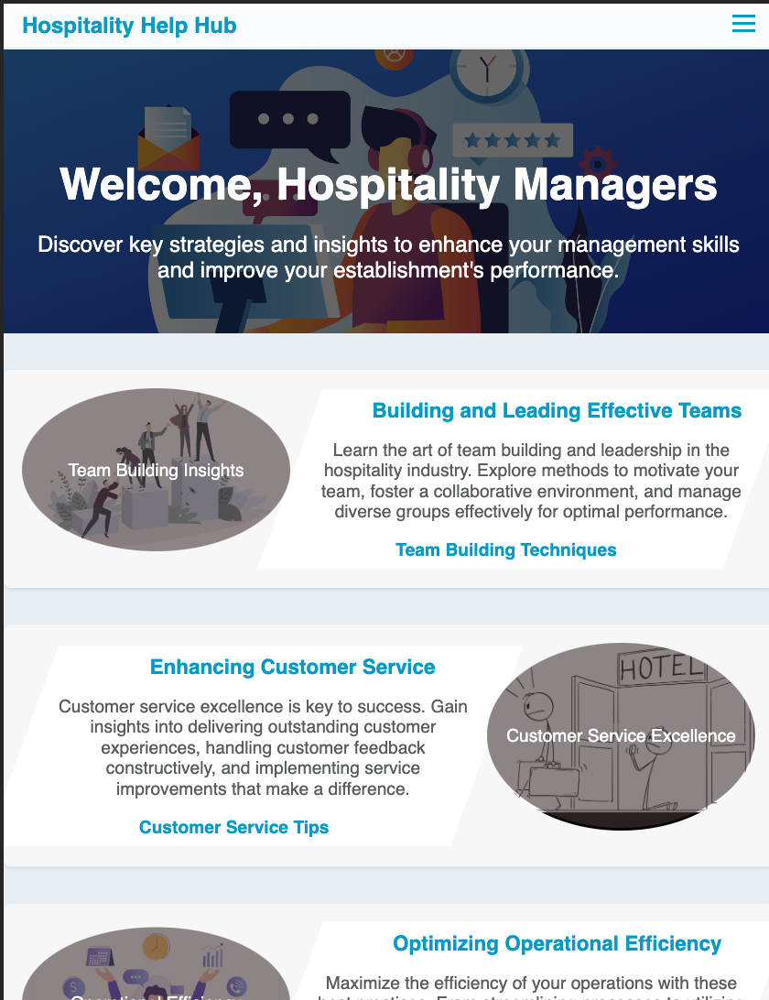
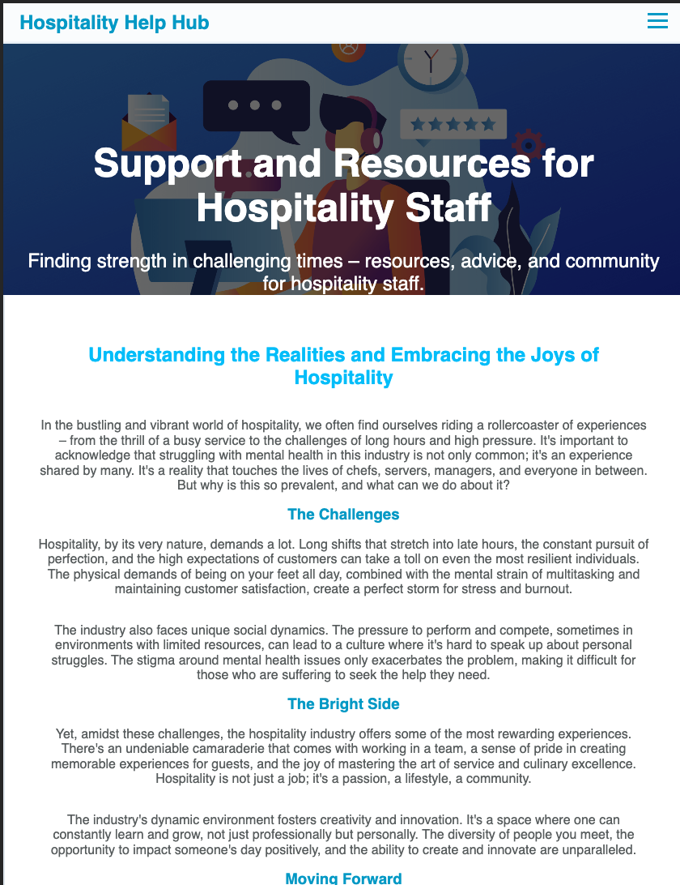

# README.md for Hospitality Help Hub

## Table of Contents
1. [Introduction](#introduction)
2. [Features](#features)
3. [Deployment](#deployment)
4. [Usage and Screenshots](#usage-and-screenshots)
5. [Attributions](#attributions)
6. [Code Organization](#code-organization)
7. [Coding Standards](#coding-standards)
8. [File Naming Conventions](#file-naming-conventions)
9. [Directory Structure](#directory-structure)
10. [License](#license)
11. [Contact](#contact)

## Introduction
Welcome to the Hospitality Help Hub, a web-based application designed to streamline and enhance the efficiency of operations in the hospitality industry. This platform serves as a comprehensive resource, offering tools and insights for improving team dynamics, operational efficiency, and overall service quality.

### Purpose
The Hospitality Help Hub aims to provide managers and staff in the hospitality sector with a centralized platform for resources and tools needed to optimize their daily operations, enhance team collaboration, and improve customer satisfaction.

### Value Proposition
Our application empowers users by:
- Enhancing team collaboration and efficiency.
- Streamlining operational processes.
- Providing valuable insights for service improvement.

## Features
Hospitality Help Hub includes several key features, each designed to address specific needs within the hospitality industry:

1. **Team Building Module:** Facilitates effective team-building activities and strategies.
2. **Operations Management Tool:** Streamlines operational tasks and enhances efficiency.

## Deployment
To deploy the Hospitality Help Hub, follow these steps:
1. Clone the repository from [GitHub repo link].
2. Install necessary dependencies using `npm install`.
3. Run the application using `npm start`.
4. The application will be available at `http://localhost:3000`.

## Usage and Screenshots
Below are the key features with their descriptions and screenshots:

### home 

The Home Page serves as the welcoming gateway to the Hospitality Help Hub. It offers a user-friendly interface to navigate to various modules of the application. This page highlights the core features and provides quick access to team-building tools, operational dashboards, and other resources.

### Owner Page

The Owner's Page is a specialized dashboard designed for business owners in the hospitality industry. This page focuses on providing high-level insights into business operations, enabling owners to make informed decisions. Features include financial oversight, staff performance tracking, and strategic planning tools.
### Managers Page

The Manager's Page is tailored for those overseeing daily operations within the hospitality sector. This comprehensive dashboard offers tools for staff management, resource allocation, and operational efficiency tracking. It's designed to streamline managerial tasks and enhance overall operational flow.
### Staff Page

The Staff Page is an interactive platform for front-line employees. It provides access to schedules, task lists, and communication tools. This page is essential for ensuring that staff members are well-informed and equipped to deliver exceptional service to customers.
## Attributions
- Team Building content and images are attributed to [Reality HR](https://www.realityhr.co.uk/five-benefits-of-team-building-exercises-and-some-pitfalls-to-watch-out-for/).
- Operations Management insights and images are sourced from [CFlow](https://www.cflowapps.com/operational-efficiency/).

External code sources are attributed in comments above the respective code sections in the source files.

## Code Organization
index.html = home
"user type".html = "user type" page

## Coding Standards
The codebase adheres to the following standards:
- Consistent indentation (2 spaces).
- Blank lines are limited to pairs for separation of logical blocks.
- Readable and descriptive variable and function names.

## File Naming Conventions
Files are named descriptively, using lowercase and underscores to ensure cross-platform compatibility, e.g., `team_building.js`.

## Directory Structure
- `style.css`: CSS file.
- `images/`: Image files.
- '.devcontainer/': build assets & docker files, 
## License
MIT License

## Contact
For any inquiries or contributions, please contact richardgoggin@gmail.com.

---
