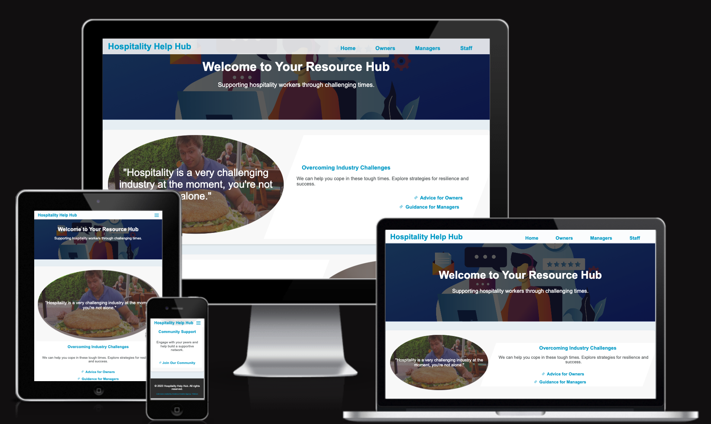
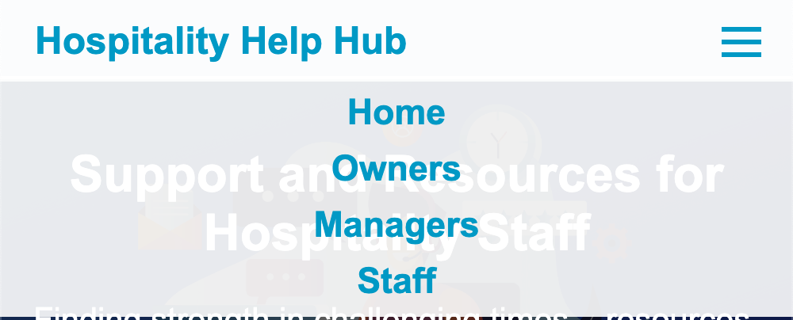
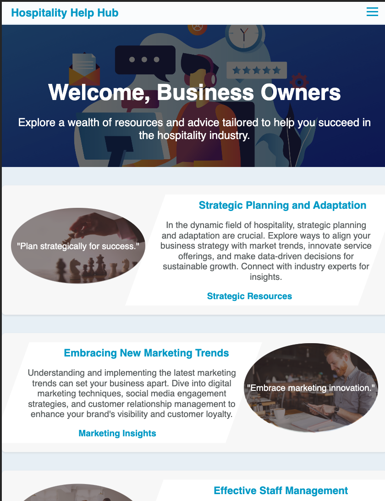
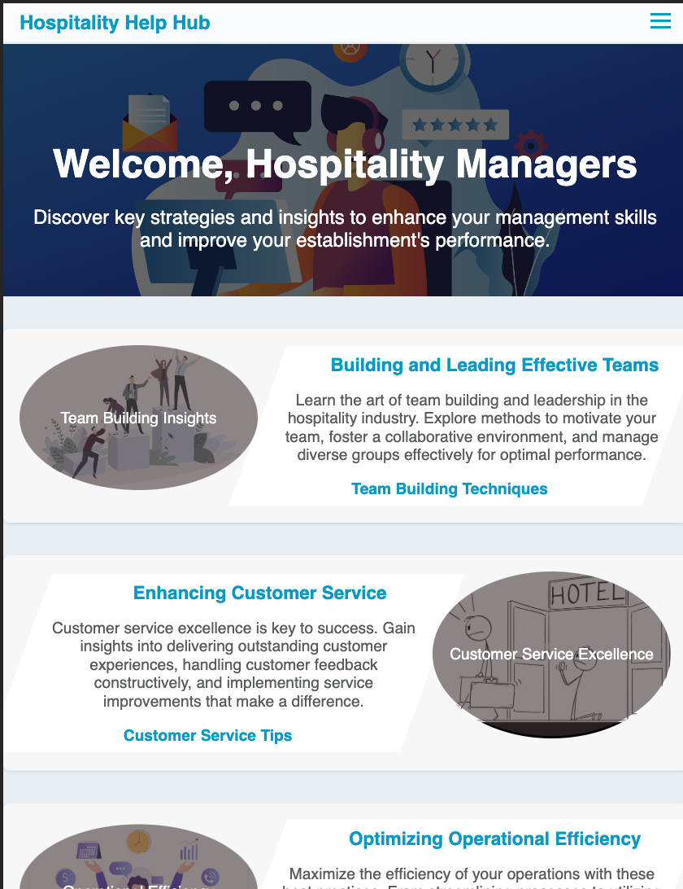

# README.md for Hospitality Help Hub

## Table of Contents

1. [Introduction](#introduction)
2. [Features](#features)
3. [Deployment](#deployment)
4. [Usage and Screenshots](#usage-and-screenshots)
5. [Attributions](#attributions)
6. [Code Organization](#code-organization)
7. [Coding Standards](#coding-standards)
8. [File Naming Conventions](#file-naming-conventions)
9. [Directory Structure](#directory-structure)
10. [License](#license)
11. [Contact](#contact)

## Introduction

Welcome to the Hospitality Help Hub, a web-based application designed to provide a supportive platform all members of the hospitality can use to help them when they need some help and encouragement. We want provide a supportive environment where they can connect with others and varioius resources designed to provide that support when they need it. We offer responsive design so we can help those hospitality workers on all devices.

https://dickiegog.github.io/hospitality-hub-project/
https://github.com/dickiegog/hospitality-hub-project

### Purpose

The Hospitality Help Hub aims to provide managers and staff in the hospitality sector with a centralized platform for resources and tools needed to help when they are struggling, help with their daily operations, enhance team collaboration, and improve customer satisfaction.

### Value Proposition

Our application gives struggling staff a place to turn by:

- Providing helpful links to useful resources.
- Encouraging them to join a wider community.
- Providing words of encouragment.

## Features

Hospitality Help Hub includes several key features, each designed to address specific needs within the hospitality industry:

1. **Team Building Module:** Facilitates effective team-building activities and strategies.
2. **Operations Management Tool:** Streamlines operational tasks and enhances efficiency.

## Deployment

<!-- From Course notes -->

To deploy the Hospitality Help Hub, follow these steps:

1. Clone repo to your own Github account.
2. Go to the Settings tab of your GitHub repo.
3. On the left-hand sidebar, in the Code and automation section, select Pages.
4. Make sure:
   - Source is set to 'Deploy from Branch'.
   - Main branch is selected.
   - Folder is set to / (root).
5. Under Branch, click Save.
6. Go back to the Code tab. Wait a few minutes for the build to finish and refresh your repo.
7. On the right-hand side, in the Environments section, click on 'github-pages'.
8. Click View deployment to see the live site. The URL will look similar to YOUR-USERNAME.github.io/lhospitality-hub-project.

## Usage and Screenshots

## Navigation Bar

The site uses a responsive navigation bar made up of four pages these are the Home page, Owner Page, Manager's Page, and Staff Page.

A user can access the other pages on the site and see what page they are currently on by looking at the menu in the navigation bar. When the user is on a page it will show that in bold text.

The menu will be changed to use the hamburger icon for small devices. I followed the steps from the Love Running project.
Navigation bar (small devices)

Below are the key features with their descriptions and screenshots:

### Home Page

The Home Page serves as the welcoming gateway to the Hospitality Help Hub. It offers a user-friendly interface to navigate to various pages of the application. This page helps the user to navigate to the page most relevant to them and also provides links to join the wider community of others in the industry that are struggling.

### Owner Page

The Owner's Page is designed for business owners in the hospitality industry. This page focuses on providing high-level insights into business operations, enabling owners to make informed decisions. This page provides a few easy links to resources to see best & latest practices for running theor business.

### Managers Page

The Manager's Page is focused around how they can better manage their team and provides links to help them organise them and make them stronger.

### Staff Page

The Staff Page is an interactive platform for hospitality employees. It provides a few words of encouragement and some useful links for a struggling emploee. We want staff members to knwo where they can turn.

## Acknowledgemet

- generated from Code-Institute-Org/ci-full-template

Images:

- Team Building content and images are attributed to [Reality HR](https://www.realityhr.co.uk/five-benefits-of-team-building-exercises-and-some-pitfalls-to-watch-out-for/).
- Operations Management insights and images are sourced from [CFlow](https://www.cflowapps.com/operational-efficiency/).
- Customer Service : (https://www.alamy.com/)
- Team Strength : (https://www.linkedin.com/pulse/connecting-your-team-members-ian-hunt/)
- Challenges : (https://blog.priceplow.com/)
- I can do it : (www.flipkart.com/)
- Chess strategy : (https://www.business-to-you.com/)
- Helpdesk : (https://www.linkedin.com/pulse/transitioning-from-helpdesk-cyber-security-role-guide-joshua-caldwell-21bae/)
- Restaurant Manager & staff training : (https://www.flipdish.com/)

External code sources are attributed in comments above the respective code sections in the source files.

## Code Organization

index.html = home
"user type".html = "user type" page

## Coding Standards

The codebase adheres to the following standards:

- Consistent indentation (2 spaces).
- Blank lines are limited to pairs for separation of logical blocks.
- Readable and descriptive variable and function names.

## File Naming Conventions

Files are named descriptively, using lowercase and underscores to ensure cross-platform compatibility, e.g., `staff.html`.

## Directory Structure

- `assets/css/style.css`: CSS file.
- `assets/images/`: Image files.
- '.devcontainer/': build assets & docker files

## Testing

- The site have been tested on primary broswers like Chrome, Firefox and Safari
- We have tested responsive design on standard devices in dev tools
- Popups and exteranl links to open in a new tab have been tested on all primary browsers
- HTML has been tested in W3C validator and CSS W3 Jigsaw, without any major errors
- Ran Lighthouse testing with

## License

MIT License

## Contact

For any inquiries or contributions, please contact richardgoggin@gmail.com.

---
